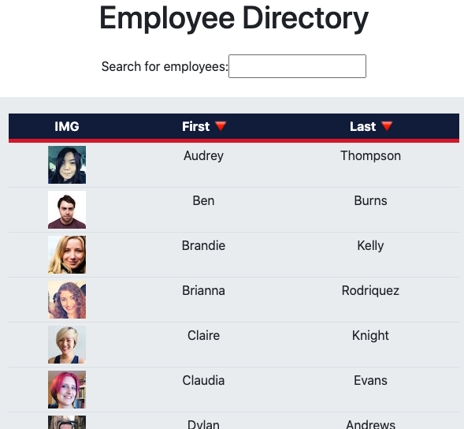
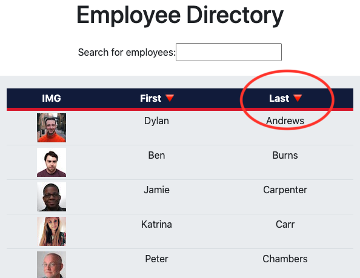
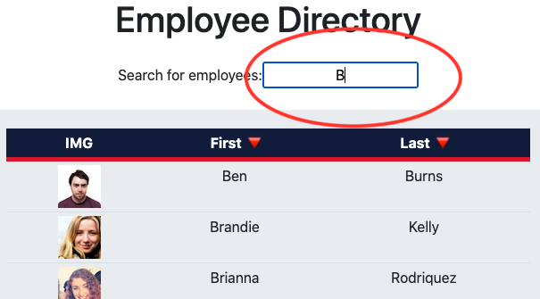

# Employee-Directory-React-App

## Deployed site 
https://adamwjones.github.io/Employee-Directory-React-App/

## Watch video here
// Coming Soon! //

## Description
This project is a React application that allows the user to view an entire employee directory at once so that they have quick access to relevant information and data. 

The code for the application's UI is broken into components. The UI components are responsive to user events via sort and filter functionality, as well as managing the component’s state independently. Finally, this project was bootstrapped with Create React App.

## Table of Contents

- [Description](#description)
- [Installation](#installation)
- [Usage](#usage)
- [Contribution](#contribution)
- [Test](#test)
- [License](#license)
- [Questions](#questions) 
- [Screenshots](#screenshots)

### Installation
Please follow these unique installation instructions (if necessary): Make sure to run npm install and all dependencies. To quickly run this React application, type `npm start` in the terminal after running `npm i`.

### Usage
This application’s code is free to use following the terms of the license identified. Additional usage instructions are: Same as license 

### Contribution
This applicating was made by Adam Jones with the assistance of Benjamin Benson (a tutor for the Rutgers Full Stack Coding Bootcamp). 

### Test 
I would not trust my code (or any code) without testing it myself. Please consider performing the following testing on this application prior to use: Take a look to validate that it worked before blindly pushing it to GitHub

### License               
This application is covered under the terms of the Artistic License 2.0 
Pease refer to their site for more details of the terms of use permittable.

### Questions

* If you have any questions or comments regarding this project, please contact me at adam.w.jones2@gmail.com and I will try to reply as soon as possible. 

* If you liked this project, please check out my GitHub page at adamwjones to see more of my work.

### Screenshots

* Homepage React UI 

* Sort the table by either first name or last name categories

* Filter the users by name 

